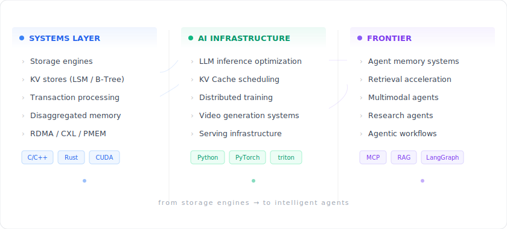

# Chaomei Yan

**Systems infrastructure × AI inference × Agent infrastructure.**

I work at the intersection of low-level systems and large-scale AI. My background is in distributed databases, storage engines, and disaggregated memory systems. Currently, I'm focused on making LLM inference faster and building the infrastructure layer for AI agents.

CS grad student at USTC. Open-source contributor. Builder.

---

### Now

- Optimizing **KV Cache scheduling** for large model inference (contributing to [Mooncake](https://github.com/kvcache-ai/Mooncake))
- Exploring **video generation / multimodal inference** acceleration
- Building infrastructure for **AI agents** — memory, retrieval, orchestration
- Researching **disaggregated memory** architectures (CXL, PMEM, RDMA)

### Technical Themes

<picture>
  
</picture>

### Open Source

| Project | What I Did |
|---------|-----------|
| [**Apache RocketMQ**](https://github.com/apache/rocketmq-clients) | Built the Python client from scratch — RPC layer, Producer, Simple Consumer, MessageIdCodec (8 merged PRs, GSoC 2023) |
| [**DLedger**](https://github.com/openmessaging/dledger) | Implemented Snapshot support for Raft-based consensus library |
| [**Kmesh**](https://github.com/kmesh-net/kmesh) | Unit test framework proposal + XDP test for eBPF service mesh |
| [**Mooncake**](https://github.com/kvcache-ai/Mooncake) | Contributing to KVCache scheduling for LLM serving (Kimi) |
| [**OpenTenBase**](https://github.com/OpenTenBase/OpenTenBase) | Slow SQL diagnostics for distributed HTAP database |
| [**Curve**](https://github.com/opencurve/curve) | Partition cleanup on persistence failure |
| [**HugeGraph AI**](https://github.com/apache/incubator-hugegraph-ai) | RAG function unit tests |

### Selected Projects

- **[LevelDB-BF-Index](https://github.com/yanchaomei/LevelDB-BF-Index)** — Bloom filter index optimization for LSM-tree based storage.
- **[Mooncake](https://github.com/kvcache-ai/Mooncake)** — Contributing to the LLM serving platform behind Kimi. Focused on KV Cache disaggregation.

### What I Care About

- **Leverage over labor.** I prefer building systems that multiply output — automation, good abstractions, AI-augmented workflows. Not a fan of scaling through headcount.
- **Research that ships.** Theory matters when it changes how systems work in practice. I want to close the gap between papers and production.
- **Infrastructure taste.** The best infra is invisible. I care about clean interfaces, minimal abstractions, and systems that degrade gracefully.

### Reach Me

- Email: [782294150@qq.com](mailto:782294150@qq.com)
- Site: [yanchaomei.github.io](https://yanchaomei.github.io)

---

Building systems that think — from storage engines to intelligent agents.
